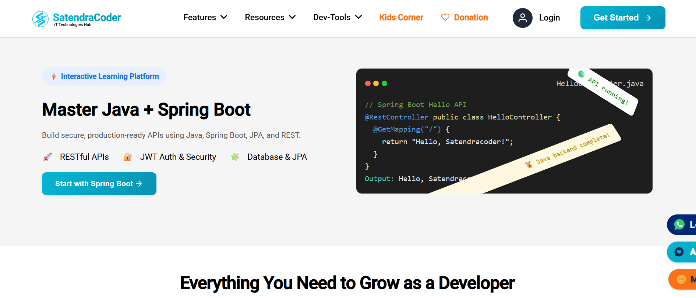

# 🚀 SatendraCoder

Welcome to the **SatendraCoder** project!  
This project is part of the SatendraCoder ecosystem where we build **useful tools, projects, and educational content** for developers.

---

## 📸 Web



---

## 🛠 Features

- Modern UI with responsive design
- Clean and optimized code structure
- Easy to extend and customize
- Open-source project

---

## 📦 Installation

Clone the repository:

```bash
git clone https://github.com/your-username/satendracoder.git
cd satendracoder
```

Install dependencies:

```bash
npm install
```

Run the project:

```bash
npm start
```

---

## 🧪 Tests

To run tests:

```bash
npm test
```

---

## 📚 Resources

- [SatendraCoder Website](https://satendracoder.com)
- [Follow on Instagram](https://instagram.com/satendracoder1)
- [Follow on YouTube](https://youtube.com/@satendracoder?si=SKEgnjAbi9JEY4JP)
- [Angular Documentation](https://angular.dev)

---

## 🙌 Contributing

Contributions are welcome!

1. Fork the repo
2. Create your feature branch (`git checkout -b feature/my-feature`)
3. Commit your changes (`git commit -m 'Add some feature'`)
4. Push to the branch (`git push origin feature/my-feature`)
5. Open a Pull Request

---

## ✍️ Author

**Satendra Rajput (SatendraCoder)**  
🌐 [satendracoder.com](https://satendracoder.com)

---

## 📜 License

This project is licensed under the **MIT License** – feel free to use and modify it.
